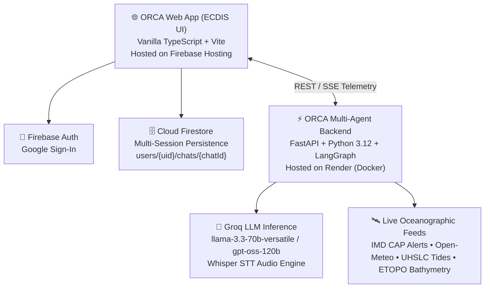
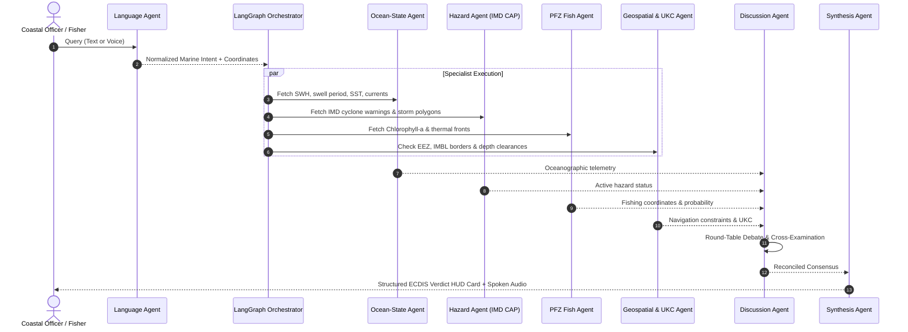

# 🌊 ORCA — Maritime Intelligence & Navigation Co-Pilot
## Comprehensive Architecture, Agent Ecosystem & Tech Stack Specification

---

## 1. Executive Summary & Mission
**ORCA** (Oceanic Reconnaissance & Coastal Advisory) is an autonomous, multi-agent maritime intelligence co-pilot engineered for **Indian coastal waters, the Indian Ocean, and the Exclusive Economic Zone (EEZ)**.

The platform provides life-critical, real-time safety advisories, Potential Fishing Zones (PFZ), oceanographic hazard alerts, and passage clearance for **coastal fishermen, marine divers, vessel skippers, and naval watch officers**.

---

## 2. Full-Stack Technology Landscape



### Frontend (`ORCA UI/`)
- **Core Engine:** Vanilla TypeScript (Strict mode) bundled with Vite 5.4.
- **Design System:** Custom **ECDIS (Electronic Chart Display & Information System)** Nautical Design Tokens (`variables.css`, `layout.css`, `components.css`).
  - Dual Theme: **ECDIS Night Station** (`#070d14` deep abyss) and **Sunlight Deck High-Visibility** (`#f4f8fa`).
- **Mapping & GIS Engine:** Leaflet.js with custom maritime vector layers, PFZ thermal rings, bathymetric contours, and IMD hazard polygon hit-testing.
- **Speech Audio Engine:** Web Speech API TTS for spoken hands-free audio advisories on boats, combined with Web Audio API speech recognition.
- **Cloud Infrastructure:** Firebase Hosting (`https://orca-2530.web.app`), Firebase Auth, and Cloud Firestore.

### Backend (`ORCA_Backend/`)
- **Core Engine:** Python 3.12 + FastAPI with asynchronous ASGI event loops.
- **Multi-Agent Orchestrator:** LangGraph 1.2 state graph managing agent concurrency, round-table debate deliberation, and synthesis.
- **LLM Provider:** Groq Cloud API (`https://api.groq.com/openai/v1`) using function-calling schema constraints (`llm_client.py`).
- **Containerization:** Docker container with dynamic `$PORT` binding on Render (`https://orca-backend-1i5u.onrender.com`).

---

## 3. Multi-Agent Deliberation Architecture

ORCA deploys a committee of 7 specialized AI agents orchestrated through a LangGraph directed acyclic graph:



### Agent Roles & Specifications:

| Agent | Core Logic & Data Connectors | Primary Output |
|---|---|---|
| **1. Language Agent** | Detects and translates 11 Indian coastal vernaculars (Marathi, Tamil, Malayalam, Telugu, Bengali, Gujarati, Kannada, Odia, Hindi). | Normalized prompt + geographic extraction |
| **2. Ocean-State Agent** | Queries Open-Meteo Marine API, UHSLC harmonic tide stations, and wind vectors. | Significant Wave Height (m), Swell (s), SST (°C) |
| **3. Hazard Agent** | Live parser for IMD CAP XML RSS feeds (`cap-sources.s3.amazonaws.com/in-imd-en`). Ray-casting polygon intersection. | Cyclone alerts, rough sea warnings, danger levels |
| **4. PFZ Agent** | Computes chlorophyll-a concentration boundaries and sea surface thermal gradients. | Highest probability fishing coordinates & species info |
| **5. Geospatial & UKC Agent** | Calculates vessel draft, under-keel clearance (UKC), tidal depths, and distance to IMBL / EEZ borders. | Safe waypoint tracks & boundary collision flags |
| **6. Discussion Agent** | Multi-agent debate mechanism where agents cross-examine findings (e.g., PFZ high fish vs. Hazard high swell). | Resolved contradictions & consensus |
| **7. Synthesis Agent** | Formulates the definitive 3-second safety verdict, metric chips, and provenance badges. | ECDIS Verdict HUD Card + Full brief |

---

## 4. Cloud Firestore Schema & Data Isolation

All user session history and chat telemetry are partitioned under the authenticated user's unique Firebase UID:

```
users/
  └── {UID}/
        ├── profile/
        │     ├── displayName: string
        │     ├── email: string
        │     ├── photoURL: string
        │     └── lastActiveAt: timestamp
        │
        └── chats/
              └── {chatId}/
                    ├── title: string
                    ├── model: string
                    ├── pinned: boolean
                    ├── messageCount: number
                    ├── updatedAt: timestamp
                    ├── lastMessagePreview: string
                    │
                    └── messages/
                          └── {messageId}/
                                ├── role: "user" | "assistant"
                                ├── content: string
                                ├── timestamp: number
                                ├── activitySteps: Array<AgentActivityStep>
                                ├── tokens: { prompt, completion, total }
                                └── reactions: { type: "like" | "dislike" }
```

### Firestore Security Rules ([`firestore.rules`](file:///c:/Users/PRANAV/OneDrive/Desktop/PRANAV%20CHOPADE/ORCA/firestore.rules)):
```javascript
rules_version = '2';
service cloud.firestore {
  match /databases/{database}/documents {
    function isAuthenticated() { return request.auth != null; }
    function isOwner(userId) { return isAuthenticated() && request.auth.uid == userId; }

    match /users/{userId} {
      allow read, write: if isOwner(userId);
      match /{allSubcollections=**} {
        allow read, write: if isOwner(userId);
      }
    }
  }
}
```

---

## 5. Coastal Fishermen & Marine Divers UX Features

1. **One-Tap Quick-Action Deck ([`FishermanDeck.ts`](file:///c:/Users/PRANAV/OneDrive/Desktop/PRANAV%20CHOPADE/ORCA/ORCA%20UI/src/components/chat/FishermanDeck.ts)):**
   - 🐟 **`PFZ HOTSPOT`**: One-tap fishing zone locator.
   - 🌊 **`24H SWELL`**: Significant wave height and swell forecast.
   - ⚠️ **`LIVE ALERTS`**: Cyclone and storm warning bulletins.
   - 🤿 **`BATHYMETRY`**: Diving depths and under-keel clearance.
2. **Spoken Audio Readout (TTS):**
   - One-tap **"🔊 Listen"** button on every advisory for hands-free audio while steering at the helm.
3. **Instant 3-Second Visual Safety Verdict:**
   - 🟢 **SAFE TO VENTURE** / 🟡 **CAUTION ADVISED** / 🔴 **UNSAFE — DANGER (Cyclone/High Swell)**.

---

## 6. Live Production Endpoints

- **Live Web Application:** [https://orca-2530.web.app](https://orca-2530.web.app)
- **Live Multi-Agent Backend:** [https://orca-backend-1i5u.onrender.com](https://orca-backend-1i5u.onrender.com)
- **GitHub Repository:** [https://github.com/pranav-4797/ORCA](https://github.com/pranav-4797/ORCA)
- **Firebase Console:** [https://console.firebase.google.com/project/orca-2530](https://console.firebase.google.com/project/orca-2530)
