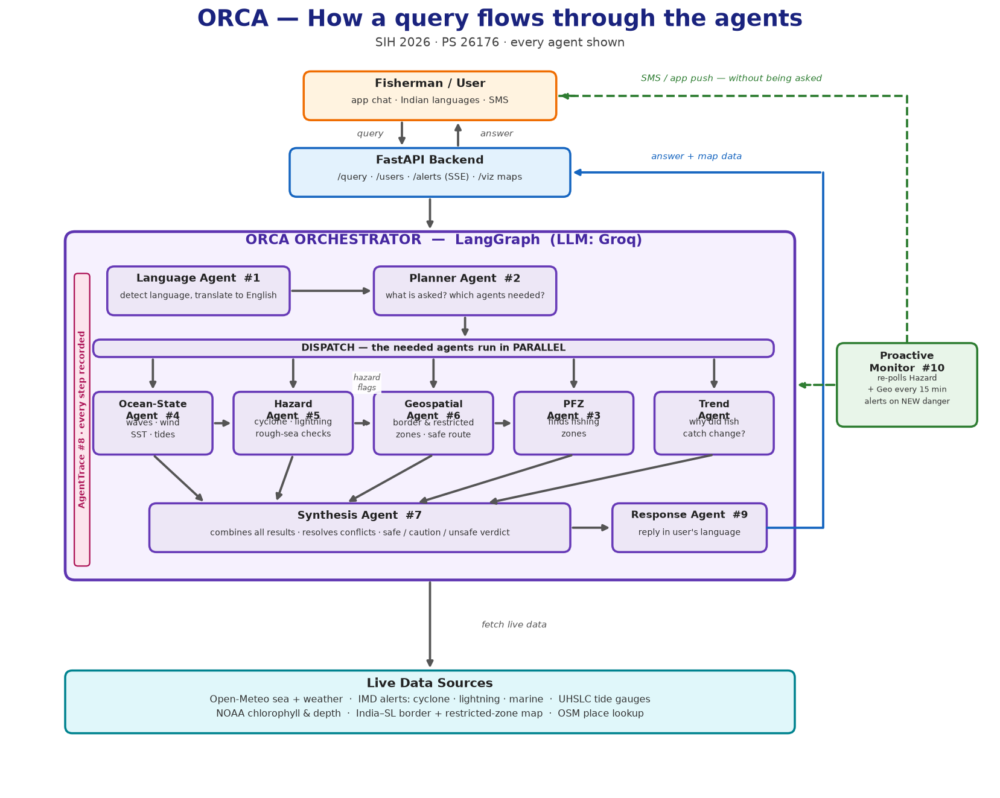
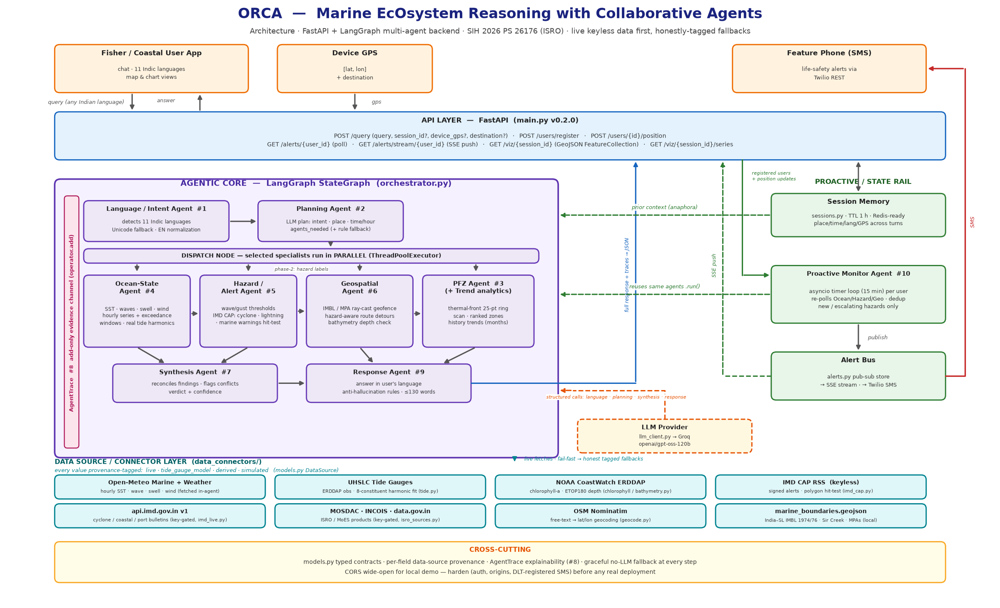
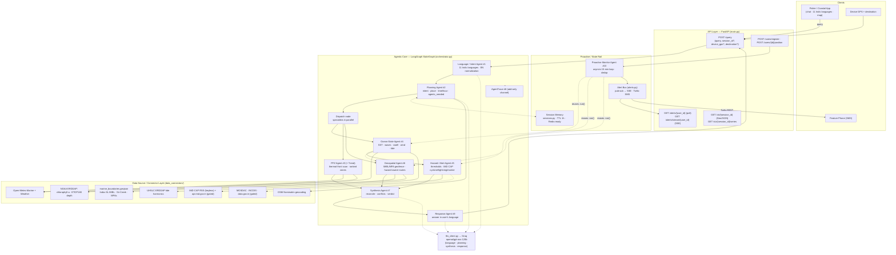

# ORCA — Architecture

**ORCA** (Marine EcOsystem Reasoning with Collaborative Agents) · SIH 2026 · PS 26176 (ISRO)
FastAPI + LangGraph multi-agent backend. Live keyless data first; every value provenance-tagged with honest fallbacks.

Detailed view (every agent, connector and endpoint)

## Flow (Mermaid)

## Component map (PS 26176 numbering)

| # | Component | File | Notes |
|---|---|---|---|
| 1 | Language / Intent | `agents/language_agent.py` | LLM detection of 11 Indic languages + Unicode-script fallback |
| 2 | Orchestrator / Planner | `orchestrator.py` | LangGraph StateGraph; LLM plan schema + rule fallback; parallel dispatch |
| 3 | PFZ | `agents/pfz_agent.py` | Official INCOIS/SAMUDRA daily advisory via nearest landing centre (KD-indexed); derived 25-pt SST-ring + SIM fallbacks |
| 4 | Ocean-State | `agents/ocean_state_agent.py` | Open-Meteo marine/weather; UHSLC harmonic tide; exceedance windows |
| 5 | Hazard / Alert | `agents/hazard_agent.py` + `data_connectors/imd_cap.py` | Wave/gust thresholds; live IMD CAP (cyclone, lightning, marine) polygon hit-test |
| 6 | Geospatial | `agents/geospatial_agent.py` | Ray-cast IMBL/MPA geofence; hazard-aware route detours; depth check |
| 7 | Synthesis | `agents/synthesis_agent.py` | Reconciles findings, flags conflicts, verdict + confidence |
| 8 | Explainability | `orchestrator.py` (`operator.add` channel), `models.py` | Add-only AgentTrace + per-field provenance |
| 9 | Response | `agents/response_agent.py` | Final answer in detected language, anti-hallucination rules |
| 10 | Proactive Monitor | `agents/proactive_monitor.py`, `alerts.py` | 15-min asyncio loop per user; SSE + Twilio SMS delivery; dedup |

## Data-source tiers

- **Tier 1 (official/live):** IMD CAP RSS (keyless, signed), api.imd.gov.in (key-gated), UHSLC tide gauges, MOSDAC/INCOIS (key-gated)
- **Tier 2 (derived/live):** Open-Meteo marine + weather, NOAA ERDDAP (chlorophyll-a, ETOP180 bathymetry), OSM Nominatim
- **Tier 3 (local/seeded):** `data/marine_boundaries.geojson` (digitized treaties), seeded last-resort values — always labelled

Every numeric field carries a `DataSource` tag (`live` / `tide_gauge_model` / `derived` / `simulated`); an unreachable feed is reported as *unverifiable*, never *clear*.
