# SIH 2026 — PS 26176: ORCA Deck

> 10-slide SIH template — clean rebuild 2026-09-09. Source: `ORCA_Backend/ARCHITECTURE.md`, `AGENTS.md`, `PPT.md` (prev. OCR dump).

---

## 1) Title

| Field | Value |
|---|---|
| **Problem Statement ID** | SIH26176 |
| **Title** | ORCA — Marine EcOsystem Reasoning with Collaborative Agents |
| **Theme** | Disaster Management |
| **Category** | Software |
| **Organization** | ISRO / Department of Space |
| **Team ID** | [To be filled] |
| **Team Name** | Airavat |

---

## 2) Problem Understanding

**Background (PS):** Every day ISRO + global agencies generate vast SST, chlorophyll, wind, wave, tide, cyclone data. Fishermen, researchers, coastal authorities need timely ocean + weather intelligence, but data is fragmented across INCOIS, IMD, MOSDAC, Bhuvan, UHSLC, etc. Volume/diversity/complexity is growing.

**What PS asks for:** Agentic AI conversational platform that:
- Understands NL intent, auto-detects language, supports multi-turn context
- Autonomously discovers/integrates satellite + marine + meteo + GIS datasets
- Performs spatial/temporal/contextual reasoning correlating heterogeneous sources
- Gives explainable evidence-backed recommendations with maps/charts/visuals/advisories
- Proactive alerts (weather/high waves/lightning/cyclones), geofencing (IMBL/MPA/eco zones), route optimization

**Typical queries to support:** nearest PFZ today; safe to venture tomorrow morning; tide/weather/sea conditions; lightning/cyclone alerts; high chlorophyll + SST regions; safest route; why productivity declined; zones to avoid (hazard/geofence).

---

## 3) Idea — ORCA

**ORCA** is a multi-agent conversational marine intelligence platform: fishermen/researchers ask by **voice or text in their own language** — ORCA reasons on live data and answers with **verdict + evidence + map**.

**Core principles:**
- **Not a single-dataset chatbot.** Correlates Ocean + Weather + PFZ + Boundaries + Hazard simultaneously (`orchestrator/` parallel dispatch).
- **Agentic collaboration, not pipeline:** Language → Planning → parallel specialists (`OceanState`→`Hazard` ∥ `PFZ` ∥ `Geospatial` ∥ `Trend`) → optional round-table `DiscussionAgent` → `SynthesisAgent` reconciliation → `ResponseAgent` in user's language (`ORCA_Backend/orchestrator/__init__.py:526`, `models.py:350`).
- **Three query modes:** `AUTO` adaptive routing (default, 0-1 LLM calls), `PANEL` full round-table, `AGENT` one specialist direct (`main.py:105`, `GET /agents`).
- **Honest provenance:** every numeric field tagged `field_sources: live | tide_gauge_model | unavailable` (`models.py:147`), `source: LIVE | UNAVAILABLE` (`models.py:39`), `evidence_tiers: Tier 1/2/3` — `unavailable ≠ clear`, never invents numbers.

---

## 4) How It Addresses the Problem

| PS Requirement | ORCA Answer |
|---|---|
| NL intent + auto language (11 Indic + romanized) | `LanguageAgent` (`agents/language_agent.py:21`) 17 langs `hi,mr,ta,te,bn,ml,kn,gu,or,kok,tcy,kfr,byr,mvv,ncr,adm,en` + script heuristic + `ROMANIZED_KEYWORDS` `state.py:115` + `fast-path` ASCII skip |
| Multi-turn context | `SessionContext` 1h TTL `sessions.py:29` + rolling history 6 turns, `mapPoint > GPS > chat` priority, pronoun resolution `orchestrator/__init__.py:3275` |
| Multi-source integration | `incois_marine.py` THREDDS WMS (SST_NIO/WW3/CURRENTS_NIO) + OceanSat-2 CHL + MOSDAC OCM primary, `incois_pfz.py` PFZ lines/centres, `imd_cap.py` CAP RSS, `tide.py` UHSLC, `bathymetry.py` GEBCO, `geocode.py` OSM (`ARCHITECTURE.md:53`) |
| Spatial/temporal/contextual | Parallel dispatch + `SynthesisAgent` conflict flag + `exceedance_windows` 48h, `tide_extremes`, `fleet_convergence`, `wind_divergence` |
| Explainable + maps/charts | `AgentTrace` `operator.add` (`models.py:325`), `GET /viz/{session_id}` GeoJSON + `GET /viz/{session_id}/series` (`main.py:730`), `OceanMap.ts` PFZ `#00E5FF` weight 4, `VizChart.ts` 48h wave/gust, `OperationalPicture.ts` |
| Proactive alerts | `ProactiveMonitorAgent` 15-min loop dedup `agents/proactive_monitor.py:86` → `alerts.py` SSE `GET /alerts/stream/{user_id}` `main.py:703` + Twilio REST (staged) |
| Geofencing | `GeospatialAgent` ray-cast vs `data/marine_boundaries.geojson` IMBL/MPA 15km buffer + KD-tree landing index `geospatial_agent.py:120` |
| Route optimization | `GeospatialAgent` A* 4km grid + GEBCO depth `<-10m` block `geospatial_agent.py:378` `<250km`, fallback sampled-detour `geospatial_agent.py:328` |
| Voice first-class | `POST /query/voice` Whisper `llm_client.py:123` `STT_MODEL=whisper-large-v3-turbo` |

---

## 5) System Architecture

**Mermaid (from `ORCA_Backend/ARCHITECTURE.md:15`):**

```mermaid
flowchart TD
    subgraph CLIENTS["Clients"]
        APP["Fisher / Coastal App<br/>(chat · 11 Indic languages · map)"]
        GPS["Device GPS + destination"]
        SMS["Feature Phone (SMS)"]
    end
    subgraph API["API Layer — FastAPI (main.py)"]
        Q["POST /query<br/>(query, session_id?, device_gps?, destination?)"]
        REG["POST /users/register · POST /users/{id}/position"]
        ALERTS["GET /alerts/{user_id} (poll)<br/>GET /alerts/stream/{user_id} (SSE)"]
        VIZ["GET /viz/{session_id} (GeoJSON)<br/>GET /viz/{session_id}/series"]
    end
    subgraph RAIL["Proactive / State Rail"]
        MEM["Session Memory<br/>sessions.py · TTL 1h · Redis-ready"]
        MON["Proactive Monitor Agent #10<br/>asyncio 15-min loop · dedup"]
        BUS["Alert Bus (alerts.py)<br/>pub-sub → SSE · Twilio SMS"]
    end
    subgraph CORE["Agentic Core — LangGraph StateGraph (orchestrator.py)"]
        LANG["Language / Intent Agent #1<br/>11 Indic languages · EN normalization"]
        PLAN["Planning Agent #2<br/>intent · place · time/hour · agents_needed"]
        DISP["Dispatch node<br/>specialists in parallel"]
        OCEAN["Ocean-State Agent #4<br/>SST · waves · swell · wind · tide"]
        HAZ["Hazard / Alert Agent #5<br/>thresholds · IMD CAP cyclone/lightning/marine"]
        GEO["Geospatial Agent #6<br/>IMBL/MPA geofence · hazard-aware routes"]
        PFZ["PFZ Agent #3 (+ Trend)<br/>thermal-front scan · ranked zones"]
        SYN["Synthesis Agent #7<br/>reconcile · conflicts · verdict"]
        RESP["Response Agent #9<br/>answer in user's language"]
        TRACE["AgentTrace #8 (add-only channel)"]
    end
    LLM["llm_client.py → Groq openai/gpt-oss-120b<br/>(language · planning · synthesis · response)"]
    subgraph SRC["Data Source / Connector Layer (data_connectors/)"]
        INCOIS["INCOIS THREDDS WMS — SST_NIO / WW3 (wind+swell) / CURRENTS_NIO<br/>+ ERDDAP OceanSat-2 CHL (incois_marine.py)"]
        MOSDAC["MOSDAC OCM chlorophyll (primary, Registered tier, 3-day latency)"]
        TIDE["UHSLC tide harmonics (tide.py)"]
        BATHY["GEBCO / INCOIS bathymetry (bathymetry.py) — A* depth check"]
        CAP["IMD CAP RSS keyless (imd_cap.py) + api.imd.gov.in gated fallback (imd_live.py)"]
        ISRO["Bhuvan WMS / Bhoonidhi SAR — staged (isro_sources.py, NOT ACTIVATED)"]
        OSM["OSM Nominatim geocoding (geocode.py)"]
        BND["marine_boundaries.geojson<br/>India–SL IMBL · Sir Creek · MPAs"]
    end
    APP -->|"query"| Q
    GPS --> Q
    Q --> LANG --> PLAN --> DISP
    DISP --> OCEAN --> HAZ
    DISP --> PFZ
    DISP --> GEO
    HAZ --> SYN
    PFZ --> SYN
    GEO --> SYN
    SYN --> RESP --> Q
    PLAN <-.-> MEM
    REG --> MON
    MON -.->|"reuses .run()"| OCEAN & HAZ & GEO
    MON --> BUS
    BUS --> ALERTS
    BUS -->|"Twilio REST"| SMS
    OCEAN --> INCOIS
    OCEAN --> MOSDAC
    OCEAN --> TIDE
    PFZ --> INCOIS
    HAZ --> CAP
    HAZ -.-> ISRO
    PLAN --> OSM
    GEO --> BND
    GEO --> BATHY
    LANG & PLAN & SYN & RESP -.-> LLM
    CORE -.-> TRACE
```

**Flow:** `START → language_intent → planning --[supported]→ specialists (parallel) → fleet_convergence → wind_divergence → discussion → synthesis → safety_floor → response → END` (`orchestrator/__init__.py:527`). No-LLM fallback: deterministic templates; no 500 on missing key/feed (`AGENTS.md:4`).

---

## 6) Technical Approach — Marine Data Fusion

**Tiered sources (`ARCHITECTURE.md:109`, `AGENTS.md:8`):**

| Tier | Source | File | Honesty |
|---|---|---|---|
| Tier 1 keyless live | INCOIS THREDDS WMS `SST_NIO_{yyyymmdd}.nc` `SST`, `rsmc_combined_ww3_{yyyymmdd}.nc` `UWND:VWND-mag`/`UWND:VWND-group`/`PHS01`, `CURRENTS_NIO_{yyyymmdd}.nc` `CURRENT`; ERDDAP OceanSat-2 `CHL`; IMD CAP RSS `cap-sources.s3.amazonaws.com/in-imd-en/rss.xml` (`imd_cap.py:58`) polygon hit-test; UHSLC tide 8-constituent harmonic (`tide.py`) | `data_connectors/incois_marine.py:45`, `incois_pfz.py:53`, `imd_cap.py`, `tide.py` | `DataSource.LIVE` / `INCOIS_LIVE` / `IMD_CAP_LIVE`, `TIDE_GAUGE_MODEL`, `unavailable` never `clear` |
| Tier 1 gated (staged, NOT ACTIVATED) | MOSDAC OCM Oceansat-3 chlorophyll (`MOSDAC_API_KEY`, 3-day latency), `api.imd.gov.in` cone-of-uncertainty, Bhuvan WMS, Bhoonidhi SAR | `isro_sources.py:258`, `sar/` | Raised `IncoisUnavailableError` with honest message, never hidden |
| Tier 2 live/derived | OSM Nominatim `countrycodes=in`, GEBCO bathymetry bbox CSV, derived SST-front PFZ ring (`PFZAgent._sample_sst_ring` 25-pt, `PFZAgent._derive_zone`) | `geocode.py`, `bathymetry.py` | `DERIVED_LIVE`, `STATIC_DERIVED` |
| Tier 3 local | `data/marine_boundaries.geojson` treaty-digitized IMBL/MPA, seeded PFZ fallback | `models.py:39` `SIMULATED`/`UNAVAILABLE` | Seeded fallback `DataSource.SIMULATED` only for PFZ, ocean fields stay `unavailable` (never fabricated) `ocean_state_agent.py:117` |

**Normalization:** `SRS=CRS:84` `BBOX` `WIDTH=11` `GetFeatureInfo text/plain` `Value:` parse + `WMS Value: 28.` fix, `ORCA_DEBUG_INCOIS` per-layer logging (`incois_marine.py:93`), 10-min cache `incois_marine.py:34`, `ORCA_OCEAN_FUTURE_TIMEOUT_S=30` (`orchestrator/__init__.py:1221`).

**Stack:** FastAPI + LangGraph `StateGraph` + Groq `openai/gpt-oss-120b` (LLM) + `whisper-large-v3-turbo` (STT) (`llm_client.py:42`), Leaflet + `flutter_map`, Firebase Auth, Redis-ready `TTLStore` (`storage.py`), Docker `ORCA_Backend/Dockerfile` + `render.yaml`.

---

## 7) Innovation & Uniqueness

| # | Innovation | What it does | File | PS Mapping |
|---|---|---|---|---|
| 1 | **Fleet Convergence Forecast** (crowding-adjusted PFZ) | Adjusts PFZ suitability by live fleet density within `FLEET_RADIUS_KM`, recommends less-crowded alternate when `crowding_ratio >=1.5` | `fleet_convergence.py`, `/fleet/simulate`, `/fleet/status`, `main.py:1188` | Improves fishing productivity + reduces fuel — PS `zone_scan` |
| 2 | **Satellite-Model Wind Divergence Flag** | Compares INCOIS WW3 forecast `wind_speed_kmh` vs MOSDAC OSCAT-3 satellite `WindObservation` (`WindObsStatus.REAL\|SIMULATED\|UNAVAILABLE`), flags `MATCH/MODERATE/HIGH_DIVERGENCE`, penalty `0.15` to confidence (`models.py:198`) — never overrides verdict | `wind_divergence.py`, `data_connectors/satellite_wind.py`, `/satellite-wind/*` | Enhances reliability — PS `evidence + reasoning` |
| 3 | **SAR-based Dark Vessel Near Boundaries** | `DemoSARProvider` / `BhoonidhiSARProvider` (auto) scans IMBL bbox, matches detections to boundary `<10km`, flags `UNKNOWN/HIGH` etc., always labels `REAL vs SIMULATED vs UNAVAILABLE` | `sar/engine.py`, `sar/store.py`, `/sar/*`, `main.py:1027` | Maritime SA — extends PS `geofencing` to authority view |
| + | **Additional** | Smart dashboard (`dashboard_agent.py`, `POST /dashboard` ranked cards + readiness 0-100), 3 heatmaps `marineService.ts` `SST/WW3/ERDDAP`, tourism POIs `tourism_agent.py` OSM, gamified learning | `ORCA UI/` | UX + PS `maps/charts/visuals` |

All 10 PS components implemented (`AGENTS.md:3`), P0/P1 gaps closed (`PFZ_INCOIS_INTEGRATION.md`, `SESSION_SUMMARY.md` Phase 13).

---

## 8) Feasibility & Viability

**Why feasible now:**
- **Free tier live data:** INCOIS THREDDS + INCOIS ERDDAP + IMD CAP RSS + UHSLC + OSM Nominatim are all **keyless, signed, <10 min lag** (`AGENTS.md:7`). No paid API needed for core PS.
- **Free LLM tier:** Groq `grok` key `GROQ_API_KEY` free tier `console.groq.com/keys` (`llm_client.py:38`), graceful fallback to rule/keyword path when missing — demo never crashes.
- **Lightweight deploy:** `docker compose up --build` (backend:8000 → Render `https://orca-backend-1i5u.onrender.com` `render.yaml`, UI → Firebase `orca-2530.web.app` `firebase.json`), `GET /health` <1ms (`main.py:139`).
- **Modular:** add agent = `models.py` + `INTENT_DEFAULT_AGENTS` + `dispatch` (`ORCA_Backend/README.md:74`).

**Viability:** Freemium for fishermen (weather/tide/PFZ free), B2G institutional dashboard (authorities/fisheries/disaster), Research licensing (historical trends, SAR). Architecture allows adding datasets/languages without redesign.

**Blocked only on credentials (code ready):** Bhuvan WMS, Bhoonidhi SAR, `api.imd.gov.in`, MOSDAC beyond stub, Twilio live-fire, PostGIS/vector DB, MOSDAC NetCDF samples (`isro_sources.py:1`, `.env.example`, `AGENTS.md:7`). Top lever: discussion+synthesis fusion to cut 12-25s cold latency.

---

## 9) Impact & Benefits

**Impacts:**
- Safer ops: location-aware cyclone/lightning/marine warnings (`hazard_agent.py:258` IMD CAP polygon) + 15km geofence buffer reduces exposure to hazards/IMBL.
- Productivity: PFZ + Fleet convergence helps find productive yet uncrowded zones; wind divergence improves trust.
- Decision: fragmented satellite/weather/GIS/advisory → actionable NL + maps.
- Emergency: 15-min proactive monitor surfaces developing risks without query.
- SA: SAR near-boundary picture for authorities.
- Access: voice + 17 languages (incl. `kok,tcy,kfr,byr,mvv`) without technical skill.

**Benefits:**
- One question vs 5 portals; current + forecast + historical + AI in one answer.
- Timely alerts reduce hazardous exposure.
- Modular — new satellites/languages/models without redesign.
- Explainable — every number cited, every fallback disclosed.
- Fuel/time saved via better zone/route selection.

**Business Model:** 1) Freemium (fishermen) 2) Government/B2G 3) Research/Academic licensing.

---

## 10) Results, Verification & References + Future/Roadmap + Team

**Results (verified without key where noted):**

| Check | Command | Expected |
|---|---|---|
| Backend syntax | `python -m py_compile ORCA_Backend/agents/*.py ORCA_Backend/models.py ORCA_Backend/main.py` | `ok` (no `Open-Meteo` leftover, `ARCHITECTURE.md` now INCOIS) |
| Smoke | `cd ORCA_Backend && python test_run.py` | Panel + direct + Marathi query pass |
| Unit | `python test_health.py test_safety_floor.py test_fleet_convergence.py test_optimized.py` | 18/19 pass (1 known `test_19_degraded` pre-existing) |
| UI | `cd "ORCA UI" && npm install && npx tsc --noEmit && npm run build` | `tsc` clean |
| Live | `GET /health` `POST /query mode=panel` + `mode=agent&agent=pfz` + session reuse `mapPoint > GPS > chat` + `GET /viz/{session_id}` `GET /api/pfz/live` | Render cold may sleep — local `uvicorn main:app --port 8000` reliable |
| Map | `OceanMap.ts` PFZ `#00E5FF` weight 4 `fitBounds` + WMS `SST_NIO_{yyyymmdd}.nc` `UWND:VWND-mag` `incois_oceansat2_datasets:CHL` | Tiles date-templated, not hardcoded (`OceanMap.ts:769`) |
| CI | `.github/workflows/ci.yml` | `py_compile` + smoke on push/PR |

**References:**

- Marine Fisheries Policy & EEZ Rules — PIB PRID 1537363 `https://www.pib.gov.in/PressReleasePage.aspx?PRID=1537363&reg=48&lang=2`
- Gaonkar et al. (2018) Ship Detection Using Sentinel-1 SAR — `https://isprs-annals.copernicus.org/articles/IV-5/317/2018/`
- Marseille & Stoffelen (2013) ASCAT Scatterometer Impact — `https://journals.ametsoc.org/view/journals/wefo/28/2/waf-d-12-00056_1.xml`
- Stoffelen et al. (2019) Remotely Sensed Winds — `https://www.frontiersin.org/articles/10.3389/fmars.2019.00443/full`
- Docs: `ORCA_Backend/ARCHITECTURE.md`, `ORCA_Backend/SESSION_SUMMARY.md` (Phases 1-13), `ORCA_Backend/PFZ_INCOIS_INTEGRATION.md`, `SESSION_LOG_2026-08-24.md`

**Roadmap:**

1. Direct ISRO/INCOIS — wire MOSDAC NetCDF samples (`mdapi.py`) beyond stub when `MOSDAC_API_KEY` approved; Bhuvan WMS verification if `isro_sources.py` account granted.
2. Vessel & Fleet — add legal vessel-tracking sources to Fleet/SAR when available.
3. Fusion — discussion+synthesis single LLM call to cut latency; PostGIS/vector DB scale-out (`storage.py` Redis-ready).

**Team Airavat:** [Add members + Team ID]. Repo `FarhanFarooqi122/orca-sih26176` branch `main` HEAD `8e77b2a` (plus 9 local fixes #1-#9).

